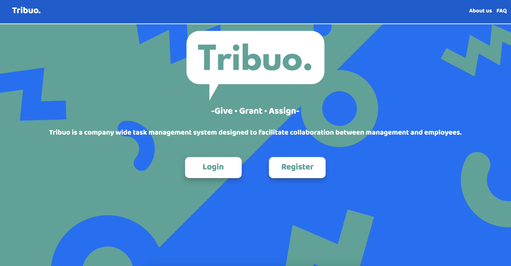
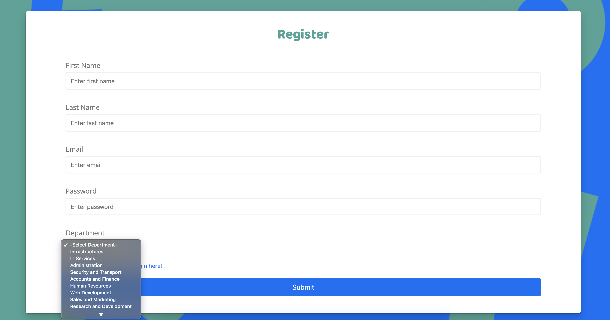
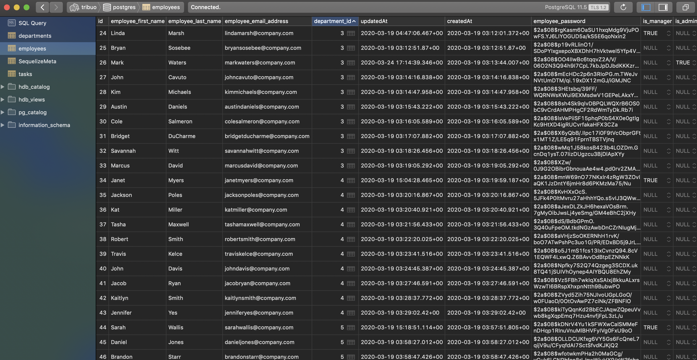
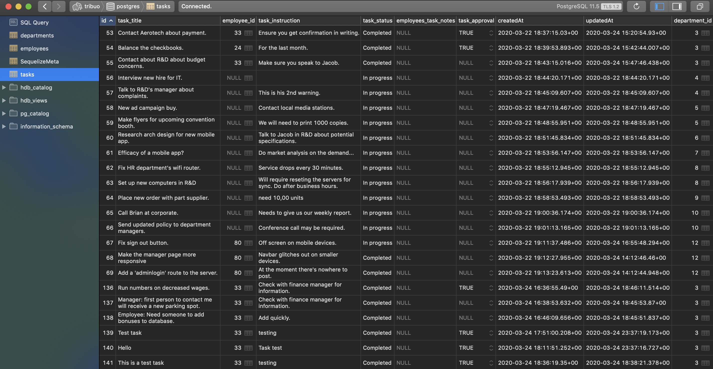
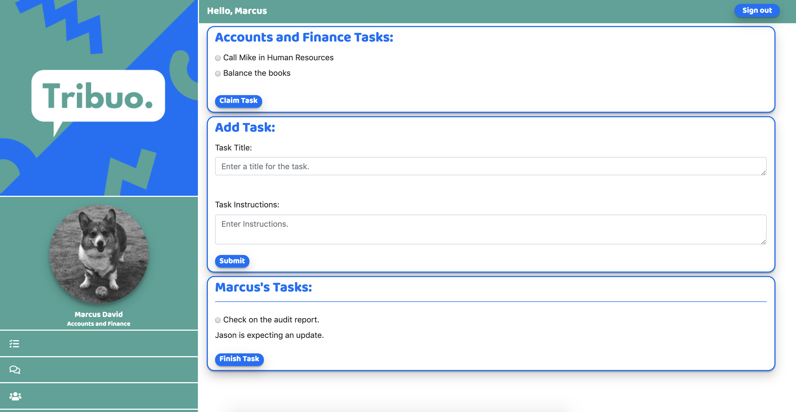
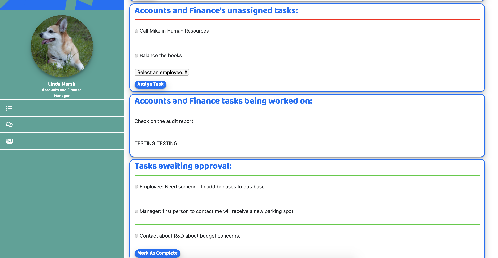

<h1>Tribuo<h1>


<h2><u>Overview:</u><h2>
<h4>Tribuo allows companies to manager their employee task workflow into departments using a relational database. The application allows for departments to be created and managers to be assigned to each department using an admin dashboard. The managers can see every task that is in their department, and they have the ability to create and assign tasks to individual employees. Employees have the ability to add tasks and claim tasks on their own dashboard, and they can submit tasks as complete to be viewed by the manager. Additional features include the ability to see tasks being created in realtime with web sockets without having to reload Tribuo. We also used Hasura to create a GraphQL server of our database which allows the admin to easily query data. In the future, we would like to add more functionality to the admin, add functionality to the employee and manager sidebars, and finish the functionality for the manager’s dashboard. Tribuo can easily be abstracted for other uses such as teacher-pupil, trainer-client, and organization-members.</h4>

<h2><u>What we used:</u></h3>
<h3>Technolgies:</h3>
<ul>
    <li>HTML5</li>
    <li>CSS3</li>
    <li>JavaScript ES6</li>
    <li>Bootstrap 4</li>
    <li>Node.js</li>
    <li>socket.io</li>
    <li>PostgreSQL</li>
    <li>Sequelized</li>
    <li>AWS</li>
    <li>Heroku</li>
    <li>Hasura</li>
    <li>GraphQL</li>
  
</ul>
<h3>Other:</h3>
<ul>
    <li>AJAX</li>
    <li>JSON</li>
    <li>Photoshop</li>
  <li>Adobe XD</li>
</ul>

</br>

<h2><u>MVP (Minimum Viable Product):</u></h2>
<ul>
    <li>Desigining and hosting a PostgreSQL database on AWS RDS.</li>
    <li>Registration and sign in for all users.</li>
    <li>Authorization and encryption on login, checking for employee's managerial status and routing to the appropriate view for their role.</li>
    <li>Grant employees the ability to add tasks to their department, claim tasks that have been added to their department pool, and mark their claimed tasks as complete.</li>
    <li>Grant managers the ability to assign tasks to their department, view the status of tasks and approve tasks once they've been submitted by employees. </li>
    <li>Responsive design</li>
</ul>

</br>

<h2><u>Stretch Goals Completed</u></h2>
<ul>
    <li>Creating an Admin page with authorization and site wide functionality.</li>
    <li>Adding Aboutus and FAQ pages.</li>
    <li>Implementing sockets so tasks updated without reloading across employees accounts.</li>
        <li>Implementing sockets so tasks updated without reloading across employees' accounts.</li>
                <li>Rerouting to the view specified by session data when returning to the homepage.</li>
                <li>Adding a sign out feature which kills the session, and returns the user home.</li>
</ul>

<h2><u>Stretch Goals Future</u></h2>
<ul>
<li>Moving away from rendering numerous templates by converting Tribuo to a single page application using React.</li>
<li>Removing placeholder images and allowing users to add their photos during account creation.</li>
<li>Add more functionality to the sidebar.</li>
</ul>

</br>

<!-- <h2><u>Challenges & Solutions:</u><h2>
<h3>Some of the biggest challenges we faced with this project build included:</h2>

<b>Challenge:</b> Inconsistent formatting in APIs. Often paths would change arbitrarily, making it difficult to programmatically drill down required data.
</br>
<b>Solution:</b> Learned much more about our specific APIs through trial and error. Implemented try/catches for when data fetches may fail.

<b>Challenge:</b> JavaScript often executed asynchronusly.
</br>
<b>Solution:</b> Solving this issue require apporpiately using promises in conjuction with fetches.

<b>Challenge:</b> Making the site responsive for all device sizes.
</br>
<b>Solution:</b> After research, along with trial and error, we determined that CSS grid was the best/most responsive layout for our website.

</br>

<h2><u>Code Snippets:</u></h2>

<h4>Showcases how we fetched when a title was searched from the Google Books API.</h4>

```javascript
//Event listener on the search button.
searchButton.addEventListener('click', (e) => {
  e.preventDefault();
  valuableGoogleObjects2 = [];
  let input = document.querySelector('#input').value;
  let userInput = input;
  let googleBookUrl = 'https://www.googleapis.com/books/v1/volumes?q=';
  // Takes the user input and inserts into the URL of the API call.
  fetch(googleBookUrl + `${userInput}` + googleBookKey)
    .then((response) => {
      return response.json();
    })
    .then((json) => {
      initialGoogleObjects.push(json);
    })
    .then(() => {
      // Takes the returned object from the API call and parses out desired information.
      drillDownGoogle();
    })
    .then(() => {
      // Creates and populates the cards saved from the desired data.
      createBookCards(valuableGoogleObjects);
    })
    .then(() => {
      // Clears local storage for repeating searches.
      initialGoogleObjects = [];
      valuableGoogleObjects = [];
    })
    .catch(() => {
      console.log('error');
    });
});
```

<br/>

<h4>This snippet shows how we fetched <em>The New York Times</em> API, populated containers, and called a second API with the data returned from the first.</h4>

```javascript
function callNYTimes() {
  //Fetches the current best sellers from <em>The New York Times</em> API
  fetch(
    'https://api.nytimes.com/svc/books/v3/lists.json?list-name=hardcover-fiction&api-key=' +
      nyTimesKey,
    { method: 'get' }
  )
    .then((response) => {
      return response.json();
    })
    .then((json) => {
      initialBestSellers.push(json);
    })
    .then(() => {
      // Parses out desired information.
      drillDownNYTimes();
    })
    .then(() => {
      //Populated containers with the desired information.
      for (let index = 0; index < 15; index++) {
        let card = document.getElementById(`${index}`);
        let image = 'http://placecorgi.com/250';
        card.innerHTML = `

        <br>
        ${valuableBestSellers[index].Rank}.<br>
        ${valuableBestSellers[index].Title}<br>
        ${initialBestSellers[0].results[index].book_details[0].author}<br>
        Weeks as a Best Seller: ${initialBestSellers[0].results[index].weeks_on_list}<br>
        <p class="hidden" id="isbn${index}">${valuableBestSellers[index].ISBN10}</p>
        `;
      }
    })
    .then(() => {
      //Using the ISBN returned from the first API, queries a second API for cover images.
      pullCoversandReplaceFromOpenLibrary();
    });
}
```

<br />
<h4>This bit of code is very similar to the last, but shows how we adapted <em>The New York Times</em> call for dates specified by the user.</h4>

```javascript
//The function takes the date input by the user as an argument.
function callNYTimes(dateToCheck) {
  // The date passed in is then used to fetch a specific bestsellers.
  fetch(
    `https://api.nytimes.com/svc/books/v3/lists/${dateToCheck}/hardcover-fiction.json?api-key=` +
      nyTimesKey,
    { method: 'get' }
  )
    .then((response) => {
      return response.json();
    })
    .then((json) => {
      initialBestSellers.push(json);
    })
    .then(() => {
      drillDownNYTimes();
    })
    .then(() => {
      for (let index = 0; index < 15; index++) {
        let card = document.getElementById(`${index}`);
        let image = 'http://placecorgi.com/250';
        card.innerHTML = `

          <br>
          ${valuableBestSellers[index].Rank}.<br>
          ${valuableBestSellers[index].Title}<br>
          ${valuableBestSellers[index].Author}<br>
          Weeks as a Best Seller: ${valuableBestSellers[index].WeeksOnList}<br>
          <p class="hidden" id="isbn${index}">${valuableBestSellers[index].ISBN10}</p>
          `;
      }
    })
    .then(() => {
      pullCoversandReplaceFromOpenLibrary();
    });
}
``` -->

</br>

<h2>Live Demo</h2>
http://ec2-3-21-98-7.us-east-2.compute.amazonaws.com/ 
</br>

<h2>Screenshots:</h2>

<h4>Highlights the landing page of Tribuo.</h4>
<br />

<h4>The registration page, showing dynamically populated departments.</h4>
<br />

<h4>The employees database table.</h4>
<br />

<h4>The tasks database table.</h4>
<br />

<h4>Employee's view after login.</h4>
<br />

<h4>Manager's view after login.</h4>
<br />

<h2><u>The Team:</u></h2>

<h3>Austin Denny: https://github.com/abdenny</h3>
<b>Primary team role:</b>Javacript, Express, Node.js, PostgreSQL, EJS, Sequelize, prototype/concepting
</br>
</br>
<!-- <b>Contributions:</b> JavaScript for all pages, which entailed designing and manipulating HTML & CSS as necessary. Implemented our stretch goal of allowing users to search for bestseller data on specific dates and displaying those on the specificbook page. Developed JavaScript functions to efficiently obtain information from three different APIs, which involved passing information retrieved from one API to another. -->

<h3>Jaye Jensen: https://github.com/jaye-j</h3>
<b>Primary team role:</b> Front-end Designer, Graphic Artist, HTML, CSS, Bootstrap, prototype/concepting
</br>
</br>

<!-- <b>Contributions:</b> HTML and CSS for all pages. Implemented JavaScript necessary for animations on the home, current bestsellers, and find bestsellers pages. Designed logos, the color scheme, and ensured consistent design throughout the website. Executed our stretch goals of having an 'About us' and 'FAQ' page. -->

<h3>Daniel Dolan: https://github.com/daniel1dolan</h3>
<b>Primary team role:</b> Express, Node.js, PostgreSQL, Sequelize, JavaScript, socket.io, prototype/concepting

</br>
<!-- <b>Contributions:</b> Worked on creating relational database, connecting forms to database as well as database to task display, socket.io for instant updates on tasks, authorization. -->

</br>
